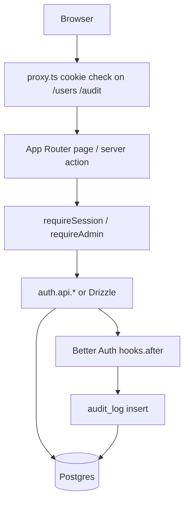

# Architecture

## Purpose

Lightweight Next.js starter for authenticated products: public landing, Better Auth (email + optional Google SSO), admin user management, and an audit trail on Drizzle + Postgres.

## High-level layout

```
src/app/                 App Router pages & API
  (auth)/                login, signup, forgot/reset password
  (dashboard)/           admin shell (side nav): users, audit
  api/auth/[...all]/    Better Auth HTTP handler
src/components/          UI + feature components
src/lib/                 auth, env, mail, audit, session guards
src/db/                  Drizzle client + schema
src/proxy.ts             Optimistic cookie redirect (not authz)
drizzle/                 SQL migrations
docs/                    Feature docs + QA cases
```

## Request flow



## Layers

| Layer | Responsibility | Examples |
| --- | --- | --- |
| UI | Present data, collect input, role-gated CTAs (UX only) | `src/app/page.tsx`, `users-table.tsx` |
| Server actions / pages | Validate input, enforce session/role, call auth or DB | `users/actions.ts`, dashboard pages |
| Auth | Sessions, passwords, OAuth, admin plugin | `src/lib/auth.ts`, `auth-client.ts` |
| Data | Schema + queries | `src/db/schema/*`, audit page Drizzle selects |
| Cross-cutting | Env validation, mail, audit mapping | `env.ts`, `mail.ts`, `audit.ts` |

There is **no** `src/fn` or `src/data-access` package. Prefer colocated server actions and thin `lib/` helpers.

## Auth & authorization model

1. **Session** — Better Auth session cookie; read via `auth.api.getSession` in `getSession()`.
2. **Roles** — `user.role` is `user` or `admin`. First admins come from `ADMIN_EMAILS` on user create (`databaseHooks.user.create.before`).
3. **Page guards** — `requireAdmin()` on `(dashboard)` layout and again in actions.
4. **Plugin enforcement** — `auth.api.setRole` / `setUserPassword` / `listUsers` / `getUser` go through the Better Auth admin plugin.
5. **Proxy** — If no session cookie, redirect to `/login`. This is not sufficient alone.

## Data fetching

Default: Server Components + server actions + `revalidatePath`. No React Query unless explicitly required later.

## Related docs

- [Authentication](./authentication.md)
- [User management](./user-management.md)
- [Audit trail](./audit-trail.md)
- [Landing & role-gated UI](./landing-and-authorization.md)
- QA: [docs/qa/](./qa/)
