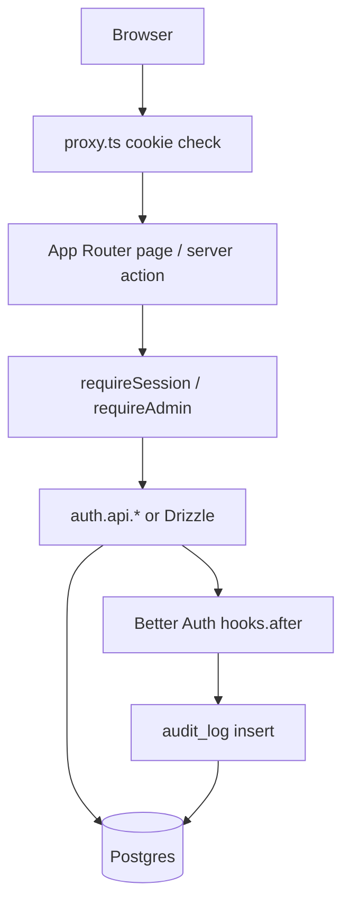

# Architecture

## Purpose

Complete-but-deletable Next.js base app: auth, app shell, admin, S3 files,
Stripe commerce, notifications, and analytics — on Drizzle + Postgres.

## High-level layout

```
src/app/
  (auth)/           login, signup, forgot/reset password
  (app)/            signed-in shell: dashboard, shop, cart, orders, settings, notifications
  (admin)/          admin shell: /admin, /users, /audit, products, orders, analytics
  api/auth/         Better Auth
  api/stripe/       Stripe webhook
  api/events/       analytics ingest
src/features/       deletable modules (account, files, commerce, notifications, analytics)
src/components/     UI + shell + analytics widgets
src/lib/            auth, env, mail, storage, stripe, notify, analytics
src/db/schema/      one file per module
src/proxy.ts        optimistic cookie redirects
drizzle/            SQL migrations
docs/               feature docs + QA
```

## Module map

| Module | Folder / schema | Delete by removing |
| --- | --- | --- |
| App shell | `features/account`, `(app)` | routes + account feature + shell components |
| Admin | `(admin)/users`, audit | keep if you still need roles |
| Files | `features/files`, `schema/file.ts`, `lib/storage*` | S3 deps + avatar UI |
| Commerce | `features/commerce`, `schema/commerce.ts` | shop/cart/orders + Stripe webhook |
| Notifications | `features/notifications`, `schema/notification.ts` | bell + notify emitters |
| Analytics | `features/analytics`, `schema/analytics.ts` | tracker + `/admin/analytics` + GA |

Each feature doc ends with a **Removing this module** section.

## Request flow



## Layers

| Layer | Responsibility | Examples |
| --- | --- | --- |
| UI | Present data, collect input | pages, feature components |
| Server actions / pages | Validate, enforce session/role | `features/*/actions.ts` |
| Auth | Sessions, passwords, OAuth, admin plugin | `src/lib/auth.ts` |
| Data | Schema + queries | `src/db/schema/*` |
| Cross-cutting | Env, mail, storage, stripe, analytics | `src/lib/*` |

## Auth & authorization model

1. **Session** — Better Auth cookie; `getSession()` / `requireSession()` / `requireAdmin()`
2. **Roles** — `user` or `admin` (`ADMIN_EMAILS` bootstrap)
3. **Page guards** — layouts + actions; `proxy.ts` is UX only
4. **Ownership** — order detail filters by `session.user.id`

## Data fetching

Server Components + server actions + `revalidatePath`. No React Query by default.

## Feature flags (env)

- `isStorageConfigured` — S3_* complete
- `isCommerceEnabled` — `STRIPE_SECRET_KEY`
- `isAnalyticsEnabled` — `NEXT_PUBLIC_GA_MEASUREMENT_ID` (GA script only; first-party events always on)

## Related docs

See [docs/README.md](./README.md).
